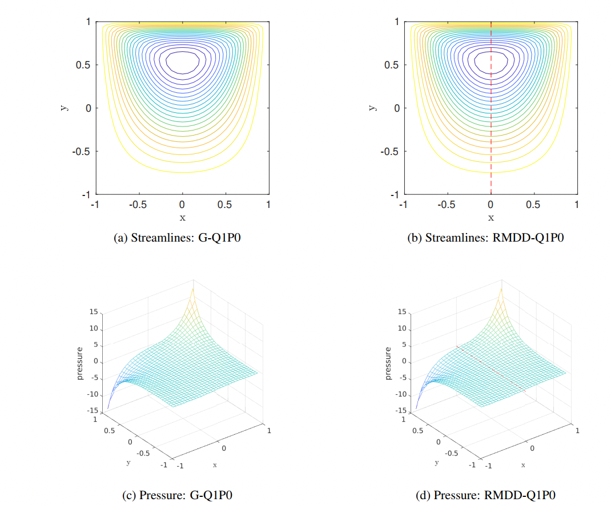
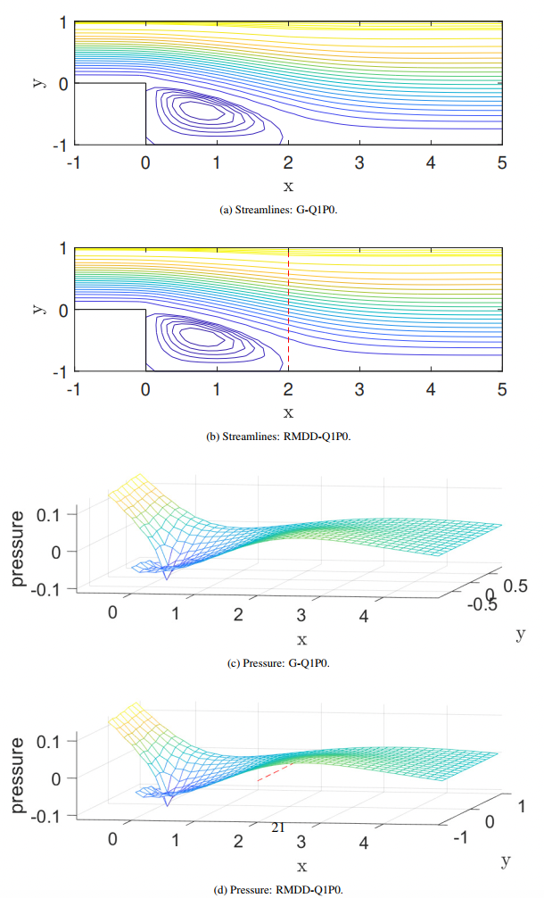
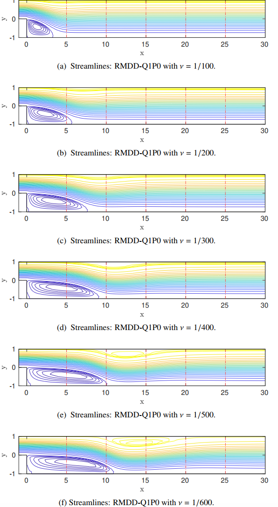

# RobinDD
This is the code corresponding to the article [Robin-type domain decomposition with stabilized mixed approximation for incompressible flow].
we present a nonoverlapping Robin-type multi-domain decomposition method based on stabilized Q1–P0 mixed approximation (RMDD-Q1P0) for incompressible flow problems. The global Stokes and Navier-Stokes equations are decomposed into a series of local problems through Robin-type domain decomposition, and local problems are solved through the local jump stabilized Q1–P0 approximation. The RMDD-Q1P0 solutions are proven to converge to the standard global Q1–P0 solutions for the Stokes problem. Numerical experiments for both Stokes and Navier-Stokes equations demonstrate that RMDD-Q1P0 significantly improves the scalability of the stabilized Q1–P0 approximation. 

# Required MATLAB packages
To use the package ensure the path contains:
- [IFISS 3.6](https://personalpages.manchester.ac.uk/staff/david.silvester/ifiss/)
  
# Set path
Download the file and CD to the current path in your computer. Then run the setpath.m file, if there is an error, you need to modify the path specified in gohome.m file (your local path). 

# Running the examples
There are five examples included corresponding to the examples in [Robin-type domain decomposition with stabilized mixed approximation for incompressible flow].
These are the scripts
```matlab
run_stokes_exact.m
```
and
```matlab
run_driven_cavity.m
```

and
```matlab
run_navier_two.m
```

and
```matlab
run_navier_six.m
```

and
```matlab
run_navier_large.m
```
